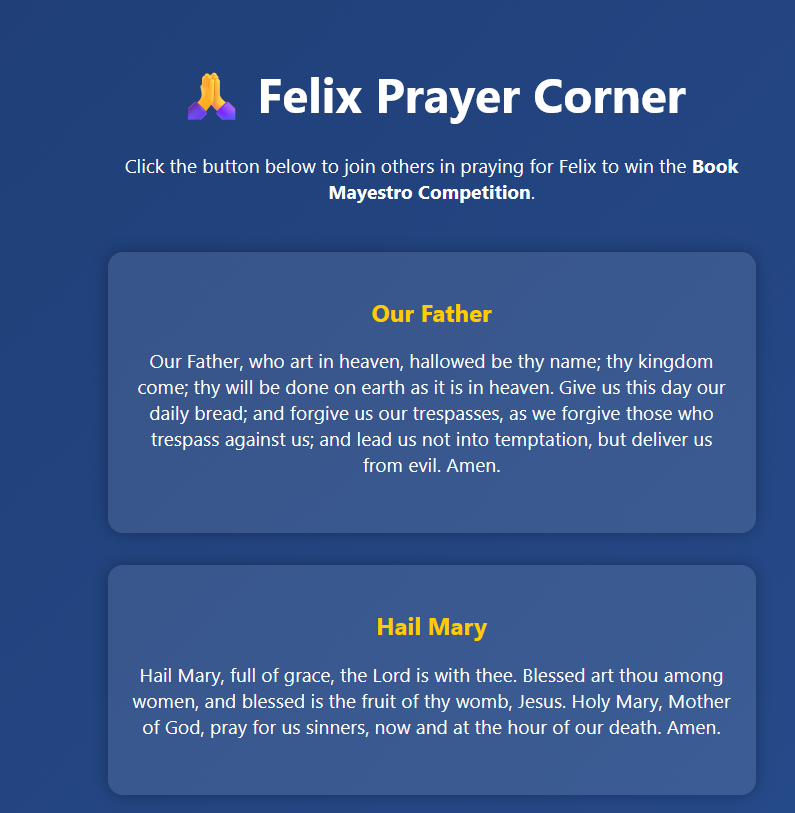

# Felix Prayer Corner

Felix Prayer Corner is a simple, interactive website where visitors can join in prayer for Felix with a single click. Each click adds to the visible prayer count, creating a sense of community and encouragement.

## ✨ Features
- **Prayer Counter**: Click the button to show you prayed. The counter updates instantly.
- **Modern Design**: Clean layout with animations and responsive styling.
- **Easy Sharing**: Hosted on GitHub Pages.

## 🌐 Live Website
[https://allanpetergiffy.github.io/felix-prayer-repo/](https://allanpetergiffy.github.io/felix-prayer-repo/)

## 📸 Screenshot Preview
Here are previews of the site:

  

## 📂 Project Structure
